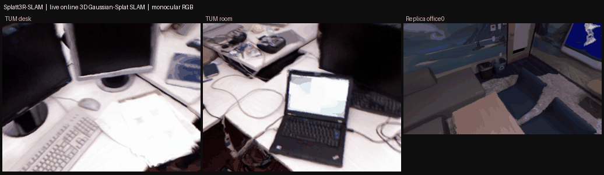
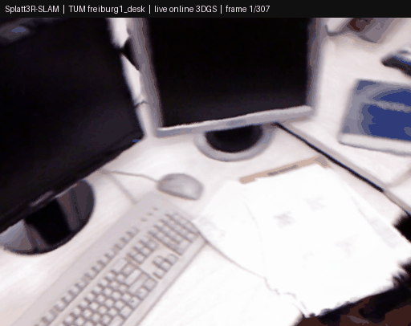
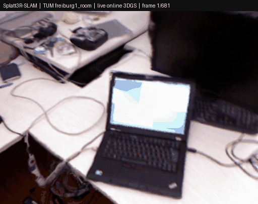
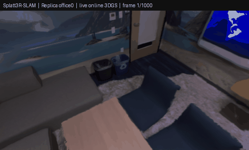

<p align="center">
  <h1 align="center">Splatt3R-SLAM: Real-Time Dense SLAM with 3D Gaussian Splatting</h1>
  <p align="center">
    Built on top of <a href="https://edexheim.github.io/mast3r-slam/">MASt3R-SLAM</a> and integrated with <a href="https://splatt3r.active.vision">Splatt3R</a>
  </p>

  <h3 align="center">
    <a href="https://splatt3r.active.vision">Splatt3R Project</a> | 
    <a href="https://edexheim.github.io/mast3r-slam/">MASt3R-SLAM Project</a>
  </h3>
  <div align="center"></div>

<p align="center">
    
</p>

<p align="center">
  <em>Live online inference: every frame above is the system's own per-frame Gaussian
  render produced while SLAM runs — not an offline re-render.</em>
</p>

<p align="center">
  
  
  
</p>
<br>

## Overview

Splatt3R-SLAM integrates [Splatt3R](https://splatt3r.active.vision) (Zero-shot Gaussian Splatting from Uncalibrated Image Pairs) into a real-time SLAM system. This combines the dense 3D reconstruction capabilities of MASt3R-SLAM with Splatt3R's 3D Gaussian Splatting for improved scene representation.

### Key Features
- **3D Gaussian Splatting**: Uses Splatt3R to predict 3D Gaussians directly from image pairs
- **Zero-shot Reconstruction**: No scene-specific training required
- **Real-time Performance**: Maintains real-time SLAM capabilities
- **Dense 3D Reconstruction**: Produces detailed 3D reconstructions with Gaussian splats
- **Online Map Refinement**: Optional background process photometrically refines the Gaussian map while SLAM runs (`--refiner`) — the map follows loop closures for free and finishes measurably sharper, with ATE unchanged
- **Fine-tuned Gaussian Heads**: Per-dataset-family head-only checkpoints that measurably beat the released weights (`--head`)
- **Per-frame PNG Export**: Saves Gaussian-rendered images for every frame by default

### Differences from MASt3R-SLAM

| Aspect | MASt3R-SLAM | Splatt3R-SLAM |
|--------|-------------|---------------|
| **Model** | MASt3R | MAST3RGaussians (Splatt3R) |
| **Output** | Points + Descriptors | Points + Descriptors + Gaussians |
| **Visualization** | OpenGL point cloud | Interactive Gaussian Splatting |
| **View Synthesis** | Limited | Excellent |

---

## Benchmark Results

All numbers below were **measured by us on one machine** (2x RTX A6000), with every
baseline built from source and run locally. Nothing is copied from a paper.
Rendering is scored under one protocol for every system: **held-out frames that are
keyframes of no system**, ground-truth poses Sim3-aligned into each map's own frame,
identical renderer and metric code. Full protocol and raw logs:
[`docs/external-baselines.md`](docs/external-baselines.md).

### Novel-view rendering — Replica, monocular (all 8 scenes)

| Scene | Ours PSNR / LPIPS | Photo-SLAM PSNR / LPIPS | ΔPSNR |
|---|---|---|---|
| office0 | **26.30** / **0.104** | 22.23 / 0.209 | +4.08 |
| office1 | **22.08** / **0.115** | 17.80 / 0.185 | +4.28 |
| office2 | **20.97** / 0.151 | 20.24 / **0.129** | +0.73 |
| office3 | **20.18** / **0.144** | 19.36 / 0.155 | +0.81 |
| office4 | **23.65** / 0.156 | 16.46 / **0.125** | +7.18 |
| room0 | **25.44** / **0.110** | 17.92 / 0.152 | +7.53 |
| room1 | **21.91** / **0.140** | 21.88 / 0.175 | +0.03 |
| room2 | **23.62** / 0.160 | 20.75 / **0.116** | +2.87 |
| **Mean** | **23.02** / **0.135** | 19.58 / 0.156 | **+3.44** |

We lead PSNR on 8/8 scenes but **LPIPS on only 5/8** — Photo-SLAM is perceptually
better on office2, office4 and room2. MonoGS is absent because it ships RGB-D-only
Replica configs; scoring its depth-input map against our monocular one would not be
a fair comparison.

### Trajectory accuracy — TUM freiburg1, ATE RMSE (m)

| Sequence | Ours | MASt3R-SLAM | VGGT-SLAM | Photo-SLAM | MonoGS |
|---|---|---|---|---|---|
| 360 | 0.0421 | 0.0482 | 0.0496 | **0.0347** | 0.1773 |
| desk | 0.0170 | 0.0161 | 0.0254 | **0.0149** | 0.0358 |
| desk2 | **0.0277** | 0.0235 | 0.0291 | 0.4385 | 0.8439 |
| floor | 0.0272 | 0.0250 | 0.0991 | **0.0133** | 0.5392 |
| plant | **0.0154** | 0.0196 | 0.0245 | 0.0461 | 0.0714 |
| room | **0.0590** | 0.0613 | 0.0638 | 0.5098 | 0.7911 |
| rpy | 0.0216 | 0.0231 | 0.0258 | 0.0566 | **0.0407** |
| teddy | **0.0476** | 0.0451 | 0.0361 | 0.3049 | 0.1230 |
| xyz | 0.0089 | 0.0089 | 0.0138 | **0.0097** | 0.0172 |
| **Mean** | **0.0296** | 0.0301 | 0.0408 | 0.1609 | 0.2933 |

The story here is **robustness, not precision**: Photo-SLAM and MonoGS each diverge
on several sequences (0.30–0.84 m = tracking failure), which is what wrecks their
means; where they do track, Photo-SLAM is often the most accurate. Our tracking is
**inherited unchanged from MASt3R-SLAM** — the parity with it is expected, and this
column is not a contribution of this project.

### System cost — TUM fr1_desk, same GPU, same sampler

| System | Wall clock | Peak GPU memory |
|---|---|---|
| Ours | 70 s | **21,035 MiB** |
| Photo-SLAM | **28 s** | **1,286 MiB** |
| MonoGS | 555 s | 2,389 MiB |
| VGGT-SLAM | 24 s | 9,436 MiB |

### Known limitations (please read before comparing)

- **Our maps are 25–100x larger.** ~2–3M Gaussians vs ~23–90K for the GS-SLAM
  baselines, and 8–16x their peak GPU memory.
- **That size is load-bearing, not padding.** Pruned to Photo-SLAM's own budget
  (~83K Gaussians, highest-opacity kept, no re-optimisation) our quality collapses
  to 8.7–10.3 dB *below* it. The quality/compactness trade-off is real.
- **Published GS-SLAM numbers are not comparable to these.** Running Photo-SLAM
  ourselves gives 22.2 dB on Replica office0 where the literature reports ~30.9 dB
  for the same system — an ~8.7 dB protocol offset, independently reproduced as an
  8.8 dB gap between rendering a map from its own estimated poses vs ground-truth
  poses. Compare only numbers produced under one protocol.
- Rendering comparison on TUM is n=1 (fr1_desk) and cannot be extended, because
  MonoGS's tracking diverges on the other sequences.

---

## Installation

### Prerequisites
- Ubuntu 20.04+ (or WSL2 on Windows)
- NVIDIA GPU (compute capability >= 7.5; developed on RTX A6000, sm_86)
- CUDA 13.x toolkit (`nvcc --version`; developed with 13.3)
- Conda/Miniconda
- Git

> **Note:** All third-party code (faiss, lietorch, asmk, in3d, pyimgui, eigen, glm,
> diff-gaussian-rasterization) is **vendored** under `thirdparty/` with the CUDA 13
> adaptations described below already applied. No git submodules are used anymore.

### Step 1: Clone Repository
```bash
git clone https://github.com/Looong01/Splatt3R-SLAM.git
cd Splatt3R-SLAM/
```

### Step 2: Create Environment
```bash
conda create -n splatt3r-slam python=3.11 -y
conda activate splatt3r-slam
```

### Step 3: Install PyTorch (CUDA 13.2 build)
```bash
pip install torch torchvision --index-url https://download.pytorch.org/whl/cu132
```
Developed with `torch 2.13.0+cu132` / `torchvision 0.28.0+cu132`.

For the original CUDA 12.4 configuration instead:
```bash
pip install torch==2.5.1 torchvision==0.20.1 torchaudio==2.5.1 --index-url https://download.pytorch.org/whl/cu124
```

### Step 4: Install Build Tools
cmake, ninja and swig are needed to compile faiss and the torch CUDA extensions;
MKL provides the BLAS backend for faiss (all via pip, no system packages required):
```bash
pip install cmake ninja swig mkl-devel
```

### Step 5: Install Python Dependencies (IN THIS ORDER!)

```bash
pip install -r requirements.txt
pip install -e thirdparty/in3d
pip install --no-build-isolation thirdparty/asmk
```

### Step 6: Build and Install faiss (GPU)
faiss is built from the vendored source in `thirdparty/faiss` (v1.14.3) with GPU
support — prebuilt PyPI packages (`faiss-cpu`, `faiss-gpu-cu12`) must NOT be
installed, they would shadow this build and pin `numpy<2`.
All required CMake options are pre-seeded in `thirdparty/faiss/CMakeLists.txt`
(GPU on, Release, CUDA arch auto-detected from the local GPU via
`CMAKE_CUDA_ARCHITECTURES=native`, BLAS auto-detected), so a plain configure
works:

```bash
cd thirdparty/faiss
cmake -B build .
make -C build -j$(nproc) faiss swigfaiss
pip install --no-build-isolation --no-deps ./build/faiss/python
cd ../..
```
The defaults prefer the active conda env (`CONDA_PREFIX`) for python/swig, and
auto-detect MKL (e.g. from `pip install mkl-devel`). If MKL is not found, faiss
automatically falls back to threaded OpenBLAS / system BLAS — install OpenBLAS
instead on AMD CPUs for better performance (MKL runs on AMD but slower). To
force a specific GPU architecture, e.g. for cross-compiling:
`cmake -B build . -DCMAKE_CUDA_ARCHITECTURES=89`.

### Step 7: Build the torch CUDA Extensions
```bash
export CUDA_HOME=/usr/local/cuda   # CUDA 13.x toolkit
export MAX_JOBS=$(nproc)           # parallel compilation

pip install --no-build-isolation thirdparty/lietorch
pip install --no-build-isolation thirdparty/diff-gaussian-rasterization-modified
pip install --no-build-isolation -e .

# Optional but recommended: CUDA RoPE2D kernel for MASt3R (otherwise a slower
# PyTorch fallback is used and a warning is printed at startup)
cd splatt3r_core/src/mast3r_src/dust3r/croco/models/curope
python setup.py build_ext --inplace
cd ../../../../../../..
```

### CUDA 13.x / torch 2.13 Adaptations (already applied in this repo)
If you build from this repository you do not need to change anything — the
following fixes are part of the vendored code:

- `setup.py`: dropped `compute_60/61/70` gencode flags (removed in CUDA 13;
  minimum is `sm_75`)
- `splatt3r_slam/backend/src/gn_kernels.cu`: `torch::linalg::linalg_norm` →
  `at::linalg_norm` (the `torch::linalg` C++ namespace was removed in torch 2.13)
- `splatt3r_slam/backend/src/matching_kernels.cu`: `D11.type()` →
  `D11.scalar_type()` in the dispatch macro
- `splatt3r_core/src/mast3r_src/dust3r/croco/models/curope/kernels.cu`:
  `tokens.type()` → `tokens.scalar_type()` (same torch 2.13 change; required to
  build the optional CUDA RoPE2D kernel)
- `splatt3r_slam/dataloader.py`: `np.unicode_` → `np.str_` (removed in NumPy 2.0)
- `main.py`, `splatt3r_core/main.py`: set `TORCH_FORCE_NO_WEIGHTS_ONLY_LOAD=1`
  because torch >= 2.6 defaults `torch.load` to `weights_only=True`, which rejects
  the pickled objects (omegaconf `DictConfig`, `argparse.Namespace`, faiss
  indices) inside the MASt3R/Splatt3R checkpoints
- `thirdparty/asmk/pyproject.toml`: dropped the `faiss-cpu` dependency (faiss is
  provided by the vendored GPU build)
- `requirements.txt`: unpinned `numpy`, replaced `faiss-gpu-cu12` with the
  vendored source build, made `torchcodec` optional
- `thirdparty/faiss/CMakeLists.txt`: pre-seeded defaults (GPU on, Release,
  CUDA arch auto-detected via `native`, MKL auto-detected with OpenBLAS
  fallback, conda python/swig) so a plain `cmake -B build .` works
- submodule `.git` metadata removed; everything is plain source in one repo

### Checkpoint
Download MASt3R backbone weights (required):
```bash
mkdir -p checkpoints/
wget https://download.europe.naverlabs.com/ComputerVision/MASt3R/MASt3R_ViTLarge_BaseDecoder_512_catmlpdpt_metric_retrieval_trainingfree.pth -P checkpoints/
wget https://download.europe.naverlabs.com/ComputerVision/MASt3R/MASt3R_ViTLarge_BaseDecoder_512_catmlpdpt_metric_retrieval_codebook.pkl -P checkpoints/
```

The Splatt3R checkpoint (`epoch=19-step=1200.ckpt`, ~150MB) will be **automatically loaded** from `checkpoints/` if present, or **downloaded from HuggingFace** on first run.
To download manually:
```bash
# https://huggingface.co/brandonsmart/splatt3r_v1.0/blob/main/epoch=19-step=1200.ckpt
wget 'https://huggingface.co/brandonsmart/splatt3r_v1.0/resolve/main/epoch%3D19-step%3D1200.ckpt' -O checkpoints/epoch=19-step=1200.ckpt
```

---

## Usage

## Command-Line Arguments

`main.py` currently supports:

| Argument | Default | Description |
|---|---:|---|
| `--dataset` | `datasets/tum/rgbd_dataset_freiburg1_desk` | Input sequence folder, video path, or `realsense` |
| `--config` | `config/base.yaml` | SLAM config YAML |
| `--save-as` | `default` | Output naming for evaluation save path |
| `--no-viz` | off | Disable interactive GUI window |
| `--calib` | `""` | Optional calibration YAML path |
| `--checkpoint` | `None` | Splatt3R checkpoint (auto-downloads if not set) |
| `--head` | `None` | Fine-tuned Gaussian-head state_dict (e.g. `checkpoints/head_only_long/<family>/`) to load on top of `--checkpoint`; the encoder stays untouched |
| `--lora` | `None` | Path to a trained LoRA adapter dir to hot-swap onto the base checkpoint. NOTE: encoder LoRA measured 49% worse than base; kept only for reproduction — prefer `--head` |
| `--render-gaussians` | on | Deprecated compatibility flag (rendering is enabled by default) |
| `--no-render-gaussians` | off | Disable Splatt3R rendering and PNG export |
| `--render-dir` | `logs/gaussian_renders` | Directory for per-frame rendered PNGs |
| `--max-gaussians` | `16777216` | Target Gaussian **render budget** across all keyframes; the baker coarsens its stride to stay under it |
| `--spatial-stride` | `1` | Per-frame Gaussian subsampling stride (`1` = no subsampling). See the warning below |
| `--depth-max-percentile` | `0.98` | Upper depth percentile kept when baking Gaussians |
| `--max-scale` | `1.0` | Clamp on predicted Gaussian scale (guards the rasterizer) |
| `--min-confidence` | `1.5` | Minimum pointmap confidence for a Gaussian to be kept |
| `--map-keyframe-stride` | `1` | Bake only every Nth keyframe into the exported Gaussian map |
| `--no-loop-closure` | off | Ablation only: disable retrieval-database loop-closure edges (never an operating mode — ATE degrades sharply) |
| `--dump-keyframe-gaussians` | off | Also write `<seq>_kfgauss.pt`: per-keyframe camera-space Gaussians + current pose, the input format of the offline refinement scripts |
| `--dump-retrieval-features` | `None` | Dump each keyframe's raw encoder feature to `DIR/<seq>/`, for retrieval whitening/codebook experiments |
| `--frame-timing` | `None` | Write per-frame wall-clock timing (tracking / backend-wait / total ms) to CSV |
| `--refiner` | off | Run the online map-refinement process (see **Online map refinement** below); requires `use_calib` |
| `--refiner-duty` | `0.25` | Refiner duty cycle when sharing one GPU: sleeps between steps to hold this share of its unthrottled rate |
| `--refiner-gpu` | `-1` (same card) | GPU index the refiner computes on, e.g. `--refiner-gpu 1` with both cards visible — measured as the deployable configuration (tracker latency unaffected) |
| `--refiner-max-gaussians` | `4000000` | Refined-map size that triggers a de-clustering (dedup) pass |
| `--refiner-dedup-voxel` | `0.0` (off) | Voxel edge in metres for the dedup pass; `0.01` measured |
| `--refiner-polish-secs` | `0.0` (off) | After the sequence ends, keep refining with the final poses for this many seconds. **The single largest online win measured: +2.21 dB psnr and −16.7% lpips over seven TUM fr1 sequences.** `300` is the measured setting |
| `--refiner-polish-tol` | `0.0` (off) | Stop the polish early once the training loss improves by less than this fraction over one logging window. Sequences need 2.4× different step counts (1445–3821) and no static quantity predicts which, so a convergence criterion is the only way to size the phase |
| `--refiner-freeze-means` | off | Hold the Gaussian centres fixed during refinement. Measured optimal at both online (~300 step) and offline (3000 step) budgets — the centres come from the network's pointmap and photometric gradients degrade them |
| `--refiner-aa-sigma` | `0.0` (off) | Band-limit the injected Gaussians against the measured lattice pitch (τ; `0.5` measured). Removes the dot/moiré lattice: 2.3× less alpha lattice and −9.7% lpips online |
| `--refiner-min-confidence` | `1.5` | Confidence gate at injection. `4.0` for maps above ~4M Gaussians |
| `--refiner-streak-opacity` | `0.5` | Reduce opacity in proportion to how long each Gaussian is relative to its local surface sampling. Measured to fade 64-98% of Gaussians by 39-65% of their opacity, so it is a **global de-hazing** weighting, not the sparse trailing-streak eraser it was originally described as (skill 17.53). Online paired A/B, 3 sequences, lpips improves on all three but by very different amounts: desk −12.7%, room −6.6%, 360 −1.3%, for −0.04 to −0.22 dB psnr. The size of the win tracks how much streaked geometry a scene actually has |
| `--refiner-unfreeze-in-polish` | off | Release the frozen centres when the polish phase begins |

> **`--spatial-stride` stability note.** The default — and the only
> recommended value — is `1` (full per-pixel density). Older revisions of
> the vendored CUDA rasterizer were observed to hit `illegal memory access`
> once enough Gaussians accumulated; the rasterizer now carries an explicit
> per-call device guard (`thirdparty/diff-gaussian-rasterization-modified/
> rasterize_points.cu`), which fixed a whole class of mixed-device crashes
> (inputs on a non-zero GPU combined with buffers allocated on device 0).
> Rebuild the extension per Step 7 if you see this crash on current code.
> The GUI slider changes the stride live.

### Online map refinement

`--refiner` starts a third worker process (alongside tracking and the pose
graph backend) that photometrically optimizes the Gaussian map while SLAM
runs. Gaussians stay in their owning keyframe's camera frame and are
composed through that keyframe's *current* pose on every render, so a
loop-closure correction re-deforms the map for free; supervision frames are
carried by their anchor keyframes for the same reason. On termination it
writes `<seq>_refined.ply` (standard 3DGS form) alongside the other
artifacts.

```bash
# Single GPU: duty-cycled so tracking keeps priority
python main.py --dataset datasets/tum/rgbd_dataset_freiburg1_desk \
    --config config/eval_calib.yaml --refiner

# Two GPUs (recommended): refiner on the second card, unthrottled
CUDA_VISIBLE_DEVICES=0,1 python main.py \
    --dataset datasets/tum/rgbd_dataset_freiburg1_desk \
    --config config/eval_calib.yaml --refiner --refiner-gpu 1 --refiner-duty 1.0
```

Measured on TUM freiburg1_desk (held-out novel views, n=100): map psnr
10.66 → **12.81** (two-GPU) with ATE bit-identical and tracker latency
within +1%. The refiner needs a fixed calibration (`use_calib: True`) and
is off by default.

#### The measured configuration

The defaults above are conservative — each quality flag is off unless asked
for. This is the configuration the experiments actually select, and the one
to use if the goal is image quality:

```bash
python main.py --dataset datasets/tum/rgbd_dataset_freiburg1_desk \
    --config config/eval_calib.yaml --refiner --refiner-gpu 1 --refiner-duty 1.0 \
    --refiner-freeze-means \
    --refiner-aa-sigma 0.5 \
    --refiner-polish-secs 300 \
    --refiner-streak-opacity 0.5
```

Each flag is a separately measured effect, and they are **additive** — the sum
of the individual deltas reproduces the total to four decimals, so they can be
adopted one at a time:

| flag | measured on | effect |
| --- | --- | --- |
| `--refiner-polish-secs 300` | 7 sequences, online | **+2.21 dB psnr, −16.7% lpips** |
| `--refiner-aa-sigma 0.5` | 360 + desk, online | −9.7% lpips, 2.3× less lattice, −0.35 dB psnr |
| `--refiner-streak-opacity 0.5` | 3 sequences, online paired A/B | −1.3% to −12.7% lpips (desk 12.7, room 6.6, 360 1.3), −0.04 to −0.22 dB psnr |
| `--refiner-freeze-means` | desk + 360, both budgets | optimum at every budget tested |

The psnr/lpips split is real and expected: the band limit and the streak fade
both trade a little fitting accuracy for a large perceptual gain, and lpips is
the metric that tracks what the artifacts look like. Absolute numbers here are
for the trajectory-anchored map on held-out frames — see
`docs/online-refinement-campaign.md` for the per-sequence tables.

**Known limits, measured rather than assumed.** Seam artifacts between
keyframe clusters are geometric, caused by the network's ~9% per-pair depth
scale error, and are *not* removable after the fact: correcting each cluster's
scale against an external reference improves the map's absolute geometry by up
to 6.4× and makes the rendered image **worse**, because SLAM fitted each pose
to that keyframe's own biased prediction and the two are only meaningful
together. Trailing streaks over single-coverage geometry, and unobserved
regions, are absences of information rather than errors.

Example with explicit rendering-related parameters:

```bash
python main.py \
  --dataset datasets/tum/rgbd_dataset_freiburg1_desk \
  --config config/base.yaml \
  --spatial-stride 1 \
  --max-gaussians 16777216 \
  --render-dir logs/gaussian_renders
```

## GUI Controls (Interactive Viz)

When GUI is enabled (default, without `--no-viz`), the left panel exposes runtime controls:

| GUI Item | Range / Default | Effect |
|---|---:|---|
| `pause` | bool | Pause frame stepping |
| `C_conf_threshold` | `0.0 .. 10.0` (default `1.5`) | Filters low-confidence points before rendering |
| `show all` | bool (on) | Show all point maps |
| `follow cam` | bool (on) | View follows current tracking camera |
| `spatial stride` | `1 .. 16` (default from CLI `--spatial-stride`) | Subsampling density control per frame |
| `max gaussians (k)` | `64k .. CLI upper bound` (default from CLI `--max-gaussians`) | Live cap on the total Gaussian render budget |
| `GS rendering (Splatt3R)` | bool (on) | Toggle Gaussian splatting rendering overlay |
| `GS resolution` | `0.1 .. 1.0` (default `1.0`) | Rendering resolution scale in viewport |
| `surfelmap` / `trianglemap` | radio | Point-cloud shader (when GS rendering is off) |
| `show_keyframe_edges` / `show_keyframe` / `show_axis` | bool | Overlay debugging visuals |
| `show_normal` / `culling` | bool | Normal display & face culling (point-cloud mode) |
| `show_curr_pointmap` | bool (on) | Show current frame point map |
| `radius` / `slant_threshold` | drag control | Point-cloud shader params |
| `line_thickness` / `frustum_scale` | drag control | Frustum/edge visualization style |

### CLI vs GUI Priority

- `--spatial-stride` and `--max-gaussians` are **startup defaults** and initialize GUI sliders.
- During GUI run, slider updates are applied live to subsequent frames.
- For PNG export in `logs/gaussian_renders/`, current GUI values of `spatial_stride` and `max_gaussians` are used; other GUI sliders are viewport-only.
- `--max-gaussians` is a **render budget**, not a preallocated buffer: Gaussians are re-baked from each keyframe every frame (there is no persistent `SharedGaussians` store -- that design was removed), and the baker raises its stride to stay under the budget. The CLI value sets the GUI slider's upper bound.
- In headless mode (`--no-viz`), only CLI values are used for the whole run.
- If `--no-render-gaussians` is set, Splatt3R rendering and PNG export are disabled regardless of GUI state.

### Quick Test
```bash
bash ./scripts/download_tum.sh
python main.py --dataset datasets/tum/rgbd_dataset_freiburg1_desk --config config/base.yaml
```

By default, per-frame Gaussian-rendered PNGs are saved to `logs/gaussian_renders/`.

### Custom Gaussian Parameters
```bash
# Higher density Gaussians (slower, better quality)
python main.py \
    --dataset datasets/tum/rgbd_dataset_freiburg1_desk \
    --config config/base.yaml \
    --spatial-stride 1 \
    --max-gaussians 8388608

# Lower density Gaussians (faster, less memory)
python main.py \
    --dataset datasets/tum/rgbd_dataset_freiburg1_desk \
    --config config/base.yaml \
    --spatial-stride 8 \
    --max-gaussians 2097152
```

### Disable PNG Saving
```bash
python main.py \
    --dataset datasets/tum/rgbd_dataset_freiburg1_desk \
    --config config/base.yaml \
    --no-render-gaussians
```

### With Camera Calibration
```bash
python main.py \
    --dataset datasets/tum/rgbd_dataset_freiburg1_room/ \
    --config config/calib.yaml

# With custom intrinsics
python main.py \
    --dataset path/to/data \
    --config config/base.yaml \
    --calib config/intrinsics.yaml
```

### Run on Video / Image Folder
```bash
python main.py --dataset path/to/video.mp4 --config config/base.yaml
python main.py --dataset path/to/image_folder --config config/base.yaml
```

If the calibration parameters are known, you can specify them in intrinsics.yaml
```bash
python main.py --dataset <path/to/video>.mp4 --config config/base.yaml --calib config/intrinsics.yaml
python main.py --dataset <path/to/folder> --config config/base.yaml --calib config/intrinsics.yaml
```

### Live Demo (RealSense)
```bash
python main.py --dataset realsense --config config/base.yaml
```

### Headless Mode (No GUI)
```bash
python main.py \
    --dataset datasets/tum/rgbd_dataset_freiburg1_desk \
    --config config/base.yaml \
    --no-viz
```

## Output

Paths below are what `splatt3r_slam/evaluate.py: prepare_savedir()` actually
produces: everything lands directly under `logs/` (or `logs/<--save-as>/` when
`--save-as` is given), and files are named after the **sequence**, i.e.
`<seq_name>` = the dataset directory's own name, e.g.
`rgbd_dataset_freiburg1_desk`.

| Output | Location | Description |
|--------|----------|-------------|
| Trajectory | `logs/<seq_name>.txt` | Camera trajectory (TUM format) |
| Reconstruction | `logs/<seq_name>.ply` | 3D point cloud (positions + colours only) |
| **Gaussian map** | `logs/<seq_name>_gaussians.ply` | **The Gaussian splatting map** in standard 3DGS `.ply` form (means, covariance as quaternion+scale, SH DC, opacity) -- openable in any 3DGS viewer and re-renderable from new viewpoints. Written automatically together with the trajectory/reconstruction saves at the end of a run |
| Refined map | `logs/<seq_name>_refined.ply` | The online-refined Gaussian map (only with `--refiner`; 3DGS form) |
| Frame trajectory | `logs/<seq_name>_frames.txt` | Estimated poses for EVERY tracked frame, anchor-resolved against final keyframe poses (TUM format) |
| Keyframe Gaussians | `logs/<seq_name>_kfgauss.pt` | Per-keyframe camera-space Gaussians + poses (only with `--dump-keyframe-gaussians`; input to the offline refinement scripts) |
| Keyframes | `logs/keyframes/<seq_name>/` | Saved keyframe images |
| GS Renders | `logs/gaussian_renders/` | Per-frame Gaussian-rendered PNGs (`--render-dir`) |

> With `--save-as NAME`, these become `logs/NAME/<seq_name>.txt`,
> `logs/NAME/<seq_name>.ply`, `logs/NAME/<seq_name>_gaussians.ply`,
> `logs/NAME/keyframes/<seq_name>/`.
>
> The Gaussian map honours `--spatial-stride`, `--depth-max-percentile`,
> `--max-scale` and `--min-confidence`, but **not** the stride-proportional
> scale inflation the live viewport applies -- that is a display-only
> compensation and would write oversized splats into a persisted file.

---

## Architecture

```
Splatt3R-SLAM/
├── main.py         # Main entry point (Splatt3R-SLAM)
├── thirdparty/
│   ├── in3d/                # OpenGL camera/visualization library
│   ├── faiss/               # FAISS v1.14.3 source (built with GPU support)
│   ├── lietorch/            # Lie groups for PyTorch (CUDA extension)
│   ├── asmk/                # ASMK image retrieval
│   ├── diff-gaussian-rasterization-modified/  # CUDA Gaussian rasterizer
│   └── eigen/               # Eigen headers
├── splatt3r_core/           # Core Splatt3R implementation
│   ├── main.py              # MAST3RGaussians Lightning module
│   ├── src/
│   │   ├── mast3r_src/      # MASt3R encoder with Gaussian head
│   │   └── pixelsplat_src/  # PixelSplat decoder (CUDA rasterizer)
│   └── utils/               # Geometry, SH, loss utilities
├── splatt3r_slam/           # SLAM package with Splatt3R
│   ├── splatt3r_utils.py    # Model loading, inference, Gaussian conversion
│   ├── tracker.py           # Frame tracking
│   ├── global_opt.py        # Global optimization / bundle adjustment
│   ├── frame.py             # Frame + SharedKeyframes (per-keyframe camera-space Gaussians)
│   ├── refiner.py           # Online map-refinement process + LocalGaussianMap + SupervisionFrames
│   ├── gaussian_ply_codec.py# 3DGS .ply encode/decode
│   ├── visualization.py     # Interactive GS rendering + OpenGL
│   └── ...                  # Other SLAM components
├── config/                  # YAML configuration files
├── scripts/                 # Dataset download & evaluation scripts
└── checkpoints/             # Model checkpoints
```

### Inference Pipeline

1. **Encode**: `model.encoder._encode_image()` → features + positions
2. **Decode**: `model.encoder._decoder()` → cross-attention tokens
3. **Downstream Head**: `model.encoder._downstream_head()` → 3D points, confidence, descriptors, **Gaussian params** (means, scales, rotations, SH, opacities)
4. **SH Residual**: Network outputs SH residuals; original image colour is added: `sh[..., 0] += RGB2SH(original_image)`
5. **World Transform**: Per-frame Gaussians are transformed to world coordinates via camera pose
6. **Rasterize**: `diff_gaussian_rasterization` renders from any viewpoint

### Splatt3R Model Output

| Parameter | Shape | Description |
|-----------|-------|-------------|
| `pts3d` | (B, H, W, 3) | 3D point estimates |
| `conf` | (B, H, W) | Confidence scores |
| `desc` | (B, H, W, 24) | Feature descriptors |
| `means` | (B, H, W, 3) | Gaussian centres |
| `scales` | (B, H, W, 3) | Gaussian scales (exp-activated) |
| `rotations` | (B, H, W, 4) | Quaternion rotations (L2-normalised) |
| `sh` | (B, H, W, 3, 1) | SH residuals (degree 0 DC only) |
| `opacities` | (B, H, W, 1) | Opacity (sigmoid-activated, [0,1]) |

---

## Downloading Datasets

### TUM-RGBD Dataset
```bash
bash ./scripts/download_tum.sh
```

### 7-Scenes Dataset
```bash
bash ./scripts/download_7_scenes.sh
```

### EuRoC Dataset
Downloads from the ETH Research Collection (three large archives, ~23 GB total;
only the required per-sequence zips are kept afterwards):
```bash
bash ./scripts/download_euroc.sh
```

### ETH3D SLAM Dataset
Downloads all training sequences from https://www.eth3d.net/slam_datasets
(resumable, already-downloaded sequences are skipped):
```bash
bash ./scripts/download_eth3d.sh
```

---

## Evaluations

All evaluation scripts run in single-threaded headless mode. Can run with or without calibration:

### TUM-RGBD
```bash
bash ./scripts/eval_tum.sh
bash ./scripts/eval_tum.sh --no-calib
```

### 7-Scenes
```bash
bash ./scripts/eval_7_scenes.sh
bash ./scripts/eval_7_scenes.sh --no-calib
```

### EuRoC
```bash
bash ./scripts/eval_euroc.sh
bash ./scripts/eval_euroc.sh --no-calib
```

### ETH3D
```bash
bash ./scripts/eval_eth3d.sh
```

---

## Troubleshooting

### "No module named 'lietorch'"
lietorch must be installed from the vendored source **before** the main package:
```bash
pip install --no-build-isolation thirdparty/lietorch
pip install --no-build-isolation -e .
```

### "No module named 'torch'" / wrong environment
```bash
conda activate splatt3r-slam
```

### "CUDA out of memory"
Reduce Gaussian density or image resolution:
```bash
# Increase spatial stride (fewer Gaussians)
python main.py --dataset ... --spatial-stride 8 --max-gaussians 2097152

# Or reduce image resolution in config:
# config/base.yaml → dataset.img_downsample: 2
```

### "Failed to download checkpoint"
Download manually:
```bash
mkdir -p checkpoints/
# Download from: https://huggingface.co/brandonsmart/splatt3r_v1.0/blob/main/epoch%3D19-step%3D1200.ckpt
python main.py --checkpoint checkpoints/epoch=19-step=1200.ckpt ...
```

### Visualization not showing
Run headless:
```bash
python main.py --dataset ... --no-viz
```

### WSL Users
```bash
git checkout windows
```
This disables multiprocessing which causes shared memory issues ([details](https://github.com/rmurai0610/MASt3R-SLAM/issues/21)).

### Quick Fix Commands
```bash
# Reinstall lietorch
pip uninstall lietorch -y && pip install --no-build-isolation thirdparty/lietorch

# Reinstall main package
pip uninstall Splatt3R-SLAM -y && pip install --no-build-isolation -e .

# Install missing dependencies
pip install Pillow opencv-python tqdm pyyaml einops
pip install lightning lpips omegaconf huggingface_hub gitpython
```

---

## Reproducibility
There might be minor differences between the released version and results in the paper after developing this multi-processing version.

The upstream MASt3R-SLAM numbers this project builds on were produced on an
RTX 4090. **This** fork is developed and run on dual RTX A6000 (sm_86), which
is also what the Prerequisites section above and the LoRA training scripts
assume -- performance and memory headroom will differ on other GPUs.

---

## Acknowledgement
We sincerely thank the developers and contributors of the many open-source projects that our code is built upon.
- [Splatt3R](https://splatt3r.active.vision) - Zero-shot Gaussian Splatting
- [MASt3R](https://github.com/naver/mast3r) - Matching and Stereo 3D Reconstruction
- [MASt3R-SfM](https://github.com/naver/mast3r/tree/mast3r_sfm)
- [MASt3R-SLAM](https://edexheim.github.io/mast3r-slam/) - Original SLAM system
- [DROID-SLAM](https://github.com/princeton-vl/DROID-SLAM)
- [ModernGL](https://github.com/moderngl/moderngl)
- [PixelSplat](https://github.com/dcharatan/pixelsplat) - Gaussian Splatting components

---

## Citation

### Splatt3R
```bibtex
@article{smart2024splatt3r,
  title={Splatt3R: Zero-shot Gaussian Splatting from Uncalibrated Image Pairs}, 
  author={Brandon Smart and Chuanxia Zheng and Iro Laina and Victor Adrian Prisacariu},
  year={2024},
  eprint={2408.13912},
  archivePrefix={arXiv},
  primaryClass={cs.CV},
}
```

### MASt3R-SLAM
```bibtex
@inproceedings{murai2024_mast3rslam,
  title={{MASt3R-SLAM}: Real-Time Dense {SLAM} with {3D} Reconstruction Priors},
  author={Murai, Riku and Dexheimer, Eric and Davison, Andrew J.},
  booktitle={Proceedings of the IEEE/CVF Conference on Computer Vision and Pattern Recognition},
  year={2025},
}
```
