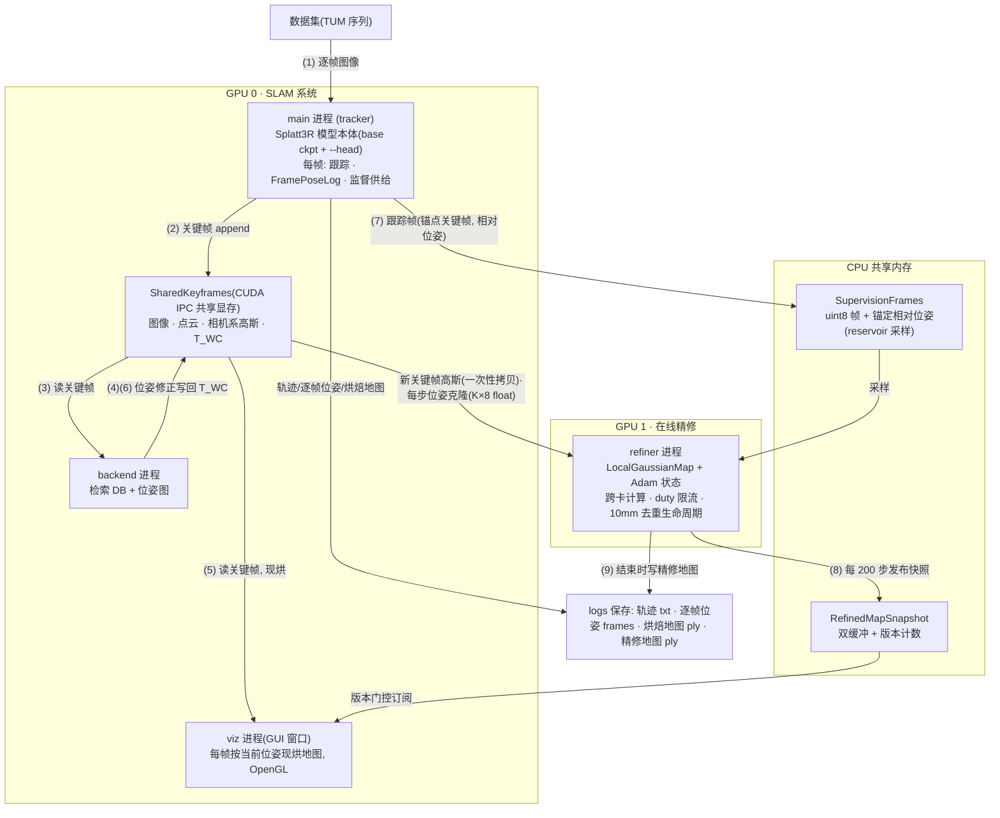

# 架构与数据流

> 对应命令:
> `CUDA_VISIBLE_DEVICES=0,1 python main.py --dataset datasets/tum/rgbd_dataset_freiburg1_360 --config config/eval_calib.yaml --head checkpoints/head_only_long/tum/head_best.pt --refiner --refiner-gpu 1 --refiner-duty 1.0 --save-as demo/360`

## 系统架构(进程与 GPU 分配)



## 数据流逐条

1. 数据集图像逐帧进主进程;Splatt3R 单帧推理 → 点云 + 相机系高斯(全部 GPU0)。
2. 关键帧 `append` 进 `SharedKeyframes`(tracker / backend / viz / refiner 四进程共享一份,不复制)。
3. backend 读关键帧做检索回环 + 位姿图优化。
4. (6) backend 把修正后的 `T_WC` 写回同一缓冲(回环 / 局部 BA)。
5. viz 每帧按**当前**位姿把各关键帧高斯烘到世界系画出来(位姿一变自动重烘)。
6. 主进程把每个跟踪帧以 `(锚点关键帧, 相对位姿)` 供给 CPU 监督池——回环修正时监督随锚点携带。
7. refiner 在 GPU1:注入新关键帧高斯(GPU0→GPU1 一次性拷贝);每步克隆位姿;采样监督、渲染、反传;每 200 步发快照给 viz;序列结束(backend 排空后)写 `_refined.ply`。
8. 快照走 CPU 共享内存——跨卡唯一不依赖 CUDA IPC 的通道。

显存实测(360 序列):GPU0 ~22 GB(模型 + 关键帧 + viz),GPU1 ~10 GB(refiner 参数 + 动量 + 渲染缓冲)。

## refiner 的实现要点

| 设计 | 依据 |
|---|---|
| 关键帧局部参数化,渲染时经当前位姿复合 `world = T_WC[kf] ⊗ local[kf]` | 回环免费(stage 3 / b′ 实测无撕裂) |
| 监督位姿锚定相对存储,采样时合成 | FramePoseLog 语义;冻结监督会撤销回环修正(实测) |
| 新关键帧到达即注入,Adam 动量跨参数数量迁移 | 非平稳性;`_optimizer_for` / `_optimizer_subset` |
| 损失 L1 + 0.2·(1−SSIM),INRIA 学习率 | 与全部离线数字同协议 |
| 储层主导采样(recent_frac 0.3) | (e) 消融:uniform 全胜 |
| duty 限流(单卡)/ 第二卡计算(双卡) | (g) 争用实测:同卡翻倍、跨卡免费 |
| 大地图超阈值触发 10mm 去重 | 双壳测量(~10mm)参数化 |
| `--refiner-polish-secs N` 序列后润色 | 大地图在线预算饥饿的补偿 |
| lietorch 位姿数学留在数据所在卡 | lietorch 在 cuda:1 静默算错(实测) |

## 组件的提交来源

| 图中组件 | 来源 |
|---|---|
| Splatt3R 模型本体 / tracker / backend / SharedKeyframes / viz 现烘 | 既有(2026-07 上旬) |
| FramePoseLog(`<seq>_frames.txt`)、监督供给、refiner 进程全套、RefinedMapSnapshot、viz 快照消费侧、`--frame-timing`、`rt_calib.yaml` | `ecd5182` 新增 |
| publish 超容降采样 + 先保存后发布;`keyframe_stride` 链路补齐;ply 自动 RGB(`gaussians_to_ply_element`);`--save-gs-view` / `--gs-view-stride`;`--gs-scale-inflate`;`--refiner-polish-secs`;`live_calib.yaml` | 之后的工作区改动(当时未提交) |
| `f82163c`(README/setup.py/pyproject.toml) | 纯文档/打包,图中无组件 |

## 附录:纯文本版架构图(在不支持 Mermaid 的查看器里看这个)

```text
┌─────────────────────────── GPU 0 ───────────────────────────┐
│ dataset ─(1)─▶ main 进程 (tracker)                          │
│                  Splatt3R 模型本体 (base ckpt + --head)     │
│                  每帧: 跟踪 · FramePoseLog · 监督供给       │
│                      │                                      │
│                      ▼ (2) 关键帧 append                    │
│              SharedKeyframes (CUDA IPC 共享显存)            │
│              图像 · 点云 · 相机系高斯 · T_WC                │
│                      ▲                  │                   │
│        (4)(6) 位姿修正写回              │ (3) 读关键帧      │
│                      │                  ▼                   │
│              backend 进程 ──(5)──▶ viz 进程 (GUI 窗口)      │
│              检索DB+位姿图          每帧现烘地图, OpenGL    │
│                                     ▲                       │
│                                     │ (8) 精修快照订阅      │
└─────────────────────────────────────┼───────────────────────┘
                                      │
┌──────────────── GPU 1 ──────────────┼───────────────────────┐
│              refiner 进程 ──(8)──▶  RefinedMapSnapshot      │
│              LocalGaussianMap       (CPU 共享, 双缓冲)      │
│              + Adam 状态                  │                 │
│              + 跨卡计算/duty 限流         ▼                 │
│              + 10mm 去重生命周期    <seq>_refined.ply       │
└─────────────────────┬───────────────────────────────────────┘
                      │ (7) 采样监督
        CPU 共享内存:  SupervisionFrames ◀──(7)── main 进程
                      (uint8 帧 + 锚定相对位姿, reservoir 采样)
```
